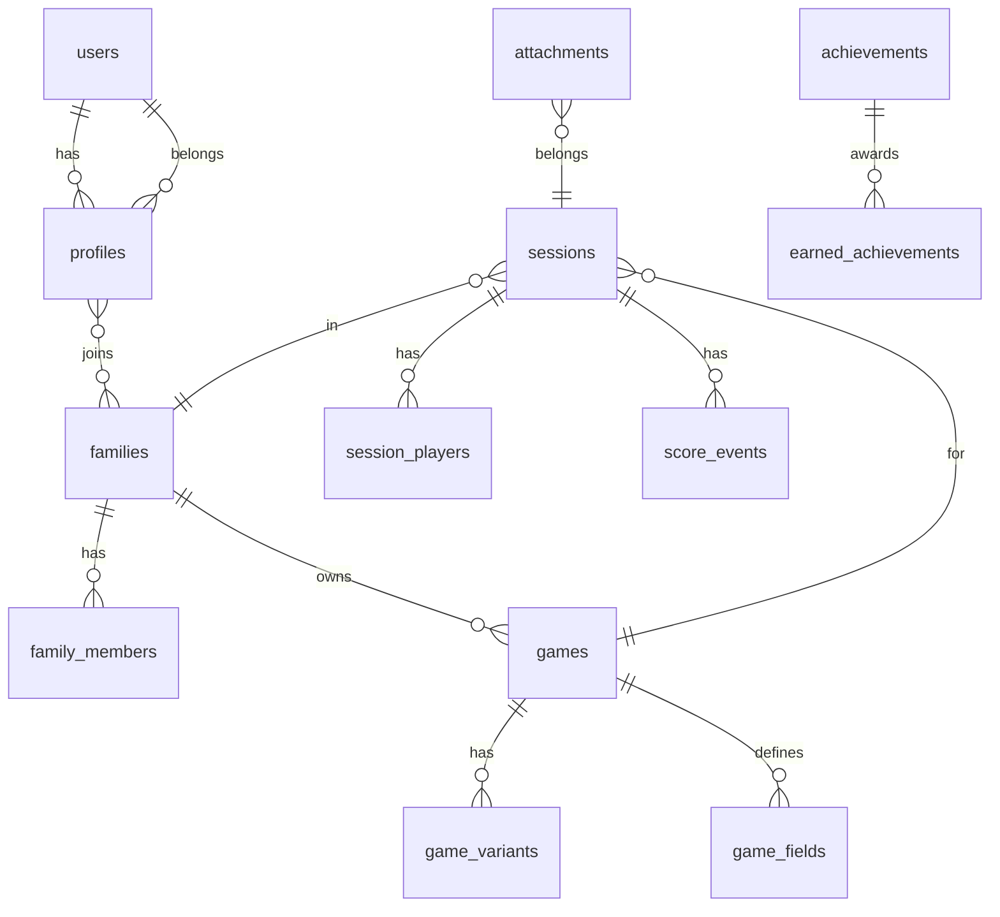

# Family Game Score Tracker

A cross‑platform score tracking app for families and friends with real‑time sync across **Web**, **iOS**, and **Android**. Supports multiple family profiles, rich match history, custom game templates, offline mode, achievements, and deep links/NFC to jump straight into a game.

---

## Table of Contents
- [Goals](#goals)
- [Feature Set](#feature-set)
- [Architecture Overview](#architecture-overview)
- [Tech Stack](#tech-stack)
- [Monorepo Structure](#monorepo-structure)
- [Data Model](#data-model)
- [Realtime & Offline Sync](#realtime--offline-sync)
- [Security & Privacy](#security--privacy)
- [App Flows](#app-flows)
- [Setup & Development](#setup--development)
- [Build & Release](#build--release)
- [Deep Linking & NFC](#deep-linking--nfc)
- [Analytics & Telemetry](#analytics--telemetry)
- [Testing Strategy](#testing-strategy)
- [CI/CD](#cicd)
- [Roadmap](#roadmap)
- [User Stories / Backlog](#user-stories--backlog)
- [License](#license)

---

## Goals
- **Zero‑friction scoring** during play, beautiful stats after.
- **One codebase** across Web/iOS/Android.
- **Multiple families/households** with shared libraries of players and games.
- **Extensible game templates** so new games can be added without code changes.
- **Works offline**, syncs when online.
- **Privacy by default** with row‑level security.

---

## Feature Set
**Core**
- Create/join **Family Profiles**; invite members by link/QR.
- Game Library with templates (e.g., Uno, Catan, Carcassonne) + custom rules.
- Start a **Match Session**; add players (drag to order/turn), quick scoring.
- **History** per family, game, and player; filters by date/season.
- **Per‑match notes & photos**.
- **Seasonal leaderboards** (monthly/annual/custom).

**Delighters**
- **Achievements & Badges** (first win, 10‑win streak, comeback win).
- **Rivalries** (head‑to‑head stats).
- **Auto‑suggest players** based on past sessions for a game.
- **Deep links/NFC** to launch a specific game template or resume last session.
- **PWA** install for desktop and mobile; shareable match recap.

---

## Architecture Overview

```mermaid
flowchart LR
    subgraph Client[Flutter App (Web/iOS/Android)]
        UI[UI Widgets]
        VM[State Mgmt (Riverpod/Bloc)]
        Cache[Local DB (Isar)]
        Sync[Sync Engine]
    end

    subgraph Backend[Supabase]
        Auth[Auth]
        DB[(Postgres)]
        RLS[Row Level Security]
        Realtime[Realtime]
        Storage[Object Storage]
        Edge[Edge Functions]
    end

    UI-->VM-->Cache
    Cache<-->Sync
    Sync<-->Realtime
    Sync<-->DB
    UI-->Storage
    Auth<-->Client
    Edge-->DB
```

**Why this shape:**
- Flutter = single UI codebase; polished animations; PWA support.
- Supabase = Postgres + Realtime channels + Storage + RLS; SQL flexibility.
- Local DB (Isar) for offline-first; background queue for mutations.

---

## Tech Stack
- **Frontend:** Flutter 3.x, Dart, Riverpod (or Bloc), GoRouter, Isar (offline), image_picker, share_plus
- **Backend:** Supabase (Auth, Postgres, Realtime, Storage, Edge Functions)
- **Infra:** Supabase managed cloud; optional self-host later
- **Tooling:** Melos (monorepo), very_good_analysis (lint), Mason (bricks), fastlane (release), GitHub Actions

---

## Monorepo Structure
```
family-score/
├─ apps/
│  ├─ mobile/                # Flutter app for iOS/Android/Web (one target)
│  └─ web/                   # (Optional) separate web shell if needed
├─ packages/
│  ├─ core_models/           # DTOs, json_serializable
│  ├─ data_access/           # Supabase client, repositories, sync engine
│  ├─ features/              # Feature modules (games, matches, profiles, stats)
│  ├─ ui_kit/                # Shared widgets, theming
│  └─ analytics/             # Telemetry abstraction
├─ supabase/
│  ├─ migrations/            # SQL migrations
│  ├─ policies/              # RLS policies
│  └─ functions/             # Edge functions (achievements, summaries)
├─ tools/
│  ├─ scripts/               # CI scripts, codegen
│  └─ mason_bricks/          # App scaffolds
└─ README.md
```

---

## Data Model



**Tables (key fields)**
- `profiles(id, user_id, display_name, avatar_url)`
- `families(id, name, created_by)`
- `family_members(family_id, profile_id, role)`
- `games(id, family_id, title, scoring_type, default_rules, is_shared)`
- `game_variants(id, game_id, name, rules_delta)`
- `game_fields(id, game_id, key, label, type, required)`  
  *Extensible schema for per‑game custom inputs (e.g., rounds, bonuses).*
- `sessions(id, family_id, game_id, started_at, ended_at, notes)`
- `session_players(session_id, profile_id, seat_order, team)`
- `score_events(id, session_id, profile_id, delta, reason, created_at)`
- `achievements(id, key, name, criteria_sql)`
- `earned_achievements(id, profile_id, achievement_id, session_id, awarded_at)`
- `attachments(id, session_id, storage_path, mime, meta)`

---

## Realtime & Offline Sync
- **Subscribe** to `sessions`, `session_players`, `score_events` per family via Supabase Realtime channels.
- **Local queue**: mutations recorded in Isar with a `pending` flag; background worker pushes to Supabase; retries with backoff.
- **Conflict strategy**: score events are **append‑only**; ordering by server timestamp; idempotent by client‑generated UUID.

---

## Security & Privacy
- **Auth:** Supabase email/password + magic link; Apple/Google sign‑in.
- **RLS policies:**
  - `families`: members can select/update; only owners can invite/delete.
  - `sessions/score_events`: restricted to members of the session’s family.
  - **Service role** used only in Edge Functions (never in client).
- **Backups:** Postgres automated backups; Storage versioning for photos.
- **PII minimization:** store only display name + email; avatars optional.

---

## App Flows
1. **Create Family** → Invite via link/QR → Accept → Role assigned.
2. **Add Game**
   - Pick from templates or create custom scoring fields.
3. **Start Session**
   - Choose game, select players, seat order → Live scoring.
4. **End Session**
   - Finalize scores → Generate recap (stats, badges, photo) → Share.

---

## Setup & Development

### Prerequisites
- Flutter SDK 3.x
- Dart 3.x
- Supabase project + CLI
- Make, Node (for tooling), Melos (optional)

### 1) Clone & bootstrap
```bash
# Install flutter deps
flutter pub get

# If using melos
dart pub global activate melos
melos bootstrap
```

### 2) Supabase init
```bash
# Install supabase CLI
brew install supabase/tap/supabase

# Login & link project
supabase login
supabase link --project-ref <YOUR_REF>

# Apply schema & policies
supabase db push
```

### 3) Environment
Create `.env` files for each app target or use `--dart-define`.

```
SUPABASE_URL=...
SUPABASE_ANON_KEY=...
SENTRY_DSN=...
```

In `main.dart`:
```dart
await Supabase.initialize(url: String.fromEnvironment('SUPABASE_URL'),
  anonKey: String.fromEnvironment('SUPABASE_ANON_KEY'));
```

### 4) Run
```bash
# Web (PWA)
flutter run -d chrome

# Android
afd devices
flutter run -d <deviceId>

# iOS
open ios/Runner.xcworkspace
flutter run -d ios
```

---

## Build & Release
- **Android:** `flutter build apk` / `appbundle` → Play Console; Fastlane for tracks.
- **iOS:** `flutter build ipa` → Transporter/TestFlight; configure Sign in with Apple.
- **Web:** `flutter build web` → deploy to Supabase Functions/Edge or static hosting with a CDN.
- **PWA:** enable service worker, manifest, icons; installable on desktop/mobile.

---

## Deep Linking & NFC
- **Deep Links:** GoRouter with `RouteInformationParser`; links like
  - `score.app/s/g/{gameId}` → open game template
  - `score.app/s/m/{sessionId}` → resume session
- **Universal Links / App Links:** apple‑app‑site‑association & assetlinks.json.
- **NFC (Android/iOS):** `nfc_manager` plugin. Encode a URI record with the deep link; tapping launches the app to that route.

---

## Analytics & Telemetry
- Abstraction package with pluggable backends (Sentry, Firebase Analytics).
- Track only **anonymous usage events** (app open, session start/end, share recap).
- Opt‑out toggle in Settings.

---

## Testing Strategy
- **Unit:** pure Dart (models, repositories, reducers).
- **Widget:** golden tests for UI states.
- **Integration:** flutter_test + local Supabase (via `supabase start`) for CI.
- **Contract:** SQL migrations validated with `sqldiff`; RLS policy tests.

---

## CI/CD
- **GitHub Actions**
  - Lint, format, tests on PR.
  - Build web artifacts; preview deploy per PR.
  - Tag → build Android AAB/IPA with Fastlane → upload to internal tracks/TestFlight.
- **Codegen gates**: json_serializable, freezed before build.

Example workflow snippet:
```yaml
name: CI
on: [push, pull_request]
jobs:
  build:
    runs-on: ubuntu-latest
    steps:
      - uses: actions/checkout@v4
      - uses: subosito/flutter-action@v2
        with:
          flutter-version: '3.x'
      - name: Deps
        run: flutter pub get
      - name: Analyze & Test
        run: |
          flutter analyze
          flutter test --coverage
      - name: Web build
        run: flutter build web --release
```

---

## Roadmap
**MVP (Weeks 1–3)**
- Auth, Families, RLS
- Game templates (Uno + Custom)
- Sessions with live score events
- History list + basic stats
- PWA & mobile builds

**v1.1 (Weeks 4–6)**
- Photos/attachments (Storage)
- Achievements (Edge Function)
- Seasonal leaderboards
- Deep links

**v1.2+**
- NFC shortcuts
- Advanced rivalries & per‑game dashboards
- Export/Import (CSV/JSON)
- Public templates gallery

---

## User Stories / Backlog

### Authentication & Profiles
- As a user, I can create an account via email or Apple/Google.
- As a user, I can create a **Family** and invite members with a link/QR.
- As an owner, I can assign member roles (owner, admin, member, child).

### Game Library
- As a user, I can browse default game templates with suggested fields.
- As a user, I can create a **custom game** with fields and scoring rules.
- As a user, I can clone and tweak a template (variants).

### Sessions & Scoring
- As a user, I can start a session, select players, and reorder seats.
- As a user, I can record score events quickly (tap to add/remove points).
- As a user, I can add a note and photo to a session.
- As a user, I can finalize and share a recap (image + link).

### History & Stats
- As a user, I can view my history by family, game, and player.
- As a user, I can filter by period (month/season/custom).
- As a user, I can see head‑to‑head and streaks.

### Delight
- As a user, I earn badges for milestones (configurable criteria).
- As a user, I can place an NFC tag on a game box to jump into scoring.

### Tech/Infra
- As a developer, I can run the app locally with `flutter run`.
- As a developer, I can run Supabase locally and seed test data.
- As a developer, I have CI that runs tests and builds web previews.

---

## License
MIT (placeholder — adjust as needed).

